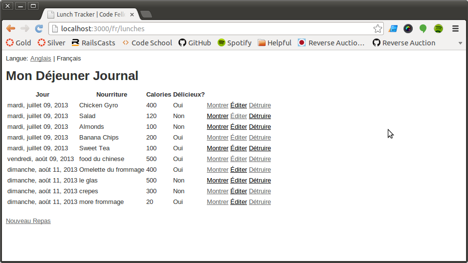
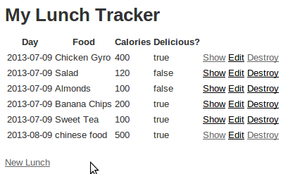
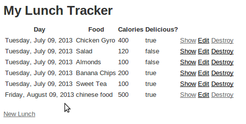

If something doesn't work, you can contact [Stephanie Datu](http://blog.stephdatu.com) at stephdatu@gmail.com and complain.

# Code Fellows App-A-Day: Lunch Tracker

By [Stephanie Datu](http://blog.stephdatu.com).

## Description
This is a simple lunch journal to keep track of the meals you eat each day. It has been updated to have custom date formatting,

## Installation

Clone the repo to your local machine. This application uses the gem [Simple Form](https://github.com/plataformatec/simple_form), so you will need to run the generator.

Run the following command to install it:

```console
bundle install
rails generate simple_form:install
rake db:setup
```

## Usage

To add a new meal to your tracker, just select "New Lunch" at the bottom of the homepage. This will bring you to a new page where you can input your lunch information.

### Add your meal! It's easy!
  1. Select the date from the drop down menu. (Remember: _30 days has September, April, June, November. All the rest have 31, except for February, which has 28. Unless it's leap year. And the next one isn't until 2016._)
  2. Enter what you ate in the "Food" field.
  3. Enter the number of calories by typing in the number or using the up and down arrows on the right of the "Calories" field.
  4. Check whether or not the meal was delicious. (If it was not delicious, do *NOT* check the box!)
  5. Click the "Create Lunch" button when you're ready to add your lunch to the tracker!
  6. When your lunch is successfully added, click "Back" to return to the homepage where you can see all your entries.

## Information

Screenshots of your application below:

English view


French view


Date format before


Date format after


Regular format
```erb
<%= form_for(@lunch) do |f| %>
  <% if @lunch.errors.any? %>
    <div id="error_explanation">
      <h2><%= pluralize(@lunch.errors.count, "error") %> prohibited this lunch from being saved:</h2>

      <ul>
      <% @lunch.errors.full_messages.each do |msg| %>
        <li><%= msg %></li>
      <% end %>
      </ul>
    </div>
  <% end %>

  <div class="field">
    <%= f.label :day %><br />
    <%= f.date_select :day %>
  </div>
  <div class="field">
    <%= f.label :food %><br />
    <%= f.text_field :food %>
  </div>
  <div class="field">
    <%= f.label :calories %><br />
    <%= f.number_field :calories %>
  </div>
  <div class="field">
    <%= f.label :delicious %><br />
    <%= f.check_box :delicious %>
  </div>
  <div class="actions">
    <%= f.submit %>
  </div>
<% end %>
```

**New and Improved** Simple Form
```erb
<%= simple_form_for(@lunch) do |f| %>
  <%= f.error_notification %>
  <%= f.input :day %>
  <%= f.input :food %>
  <%= f.input :calories %>
  <%= f.input :delicious, hint: "Check if it was delicious!" %>
  <%= f.error :base %>
  <%= f.button :submit %>
<% end %>
```

### Known Issues

If you discover any bugs, feel free to create an issue on GitHub fork and
send us a pull request.

## Authors

* Stephanie Datu (https://github.com/stephdatu)


## License

MIT. See attached file.

